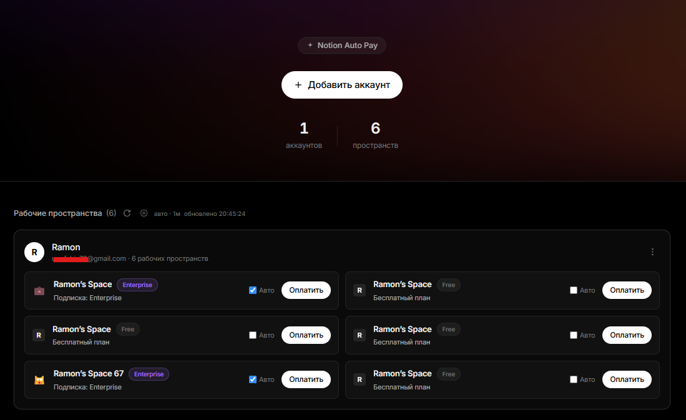

# Notion Auto Pay

**Notion Auto Pay** — локальная панель для управления несколькими аккаунтами Notion и автоматической оплаты тарифов из одного места. Добавьте `token_v2` — Notion Auto Pay сам найдёт все рабочие пространства и покажет их тарифы.

---



## Возможности

- **Пул аккаунтов** — добавляйте аккаунты по cookie `token_v2`; все пространства обнаруживаются автоматически.
- **Реальные данные пространств** — название, иконка, текущий тариф и статус подписки.
- **Автообновление** — периодическое обновление тарифа и списка пространств с настраиваемым интервалом.
- **Автооплата** — автоматическая оплата тарифа для Free-пространств через Stripe (карта и план настраиваются отдельно).
- **Защита панели паролем** — опциональный пароль на вход в веб-панель с защитой от перебора (rate limit).
- **Чистый тёмный интерфейс** — React + Tailwind, встраивается в Go-бинарник.

---

## 🚀 Быстрый старт

### Шаг 0. Если ничего не установлено

Нужны два инструмента. Установите их и **перезапустите терминал** (чтобы обновился PATH):

1. **Node.js LTS** — скачать с https://nodejs.org (ставится вместе с `npm`).
2. **Go 1.26+** — скачать с https://go.dev/dl/

Проверьте, что всё видно (каждая команда должна вывести версию):

```bash
node -v
npm -v
go version
```

Затем склонируйте проект и перейдите в его папку:

```bash
git clone https://github.com/Loki-Skylineop/Notion-Auto-Pay.git
cd Notion-Auto-Pay
```

### Шаг 1. Запуск одной командой

**Windows:**

```bat
build.bat
```

Эта одна команда сама проверит инструменты, установит зависимости фронтенда, соберёт его, встроит в бэкенд и запустит сервер.

| Команда | Действие |
|---------|----------|
| `build.bat` | собрать фронт + собрать и запустить сервер |
| `build.bat exe` | только собрать `notion-auto-pay.exe` |
| `build.bat run` | собрать фронт и запустить |
| `build.bat clean` | удалить артефакты сборки |

**Linux / macOS (через make):**

```bash
make run      # собрать фронт + бэкенд и запустить
make build    # собрать notion-auto-pay
make web      # только фронтенд
make clean    # очистить артефакты
```

### Шаг 2. Откройте панель

После запуска откройте в браузере: **http://localhost:8081/dashboard/**

---

## 🔐 Защита панели паролем

По умолчанию веб-панель открыта. Чтобы потребовать пароль при входе, передайте его одним из способов.

**1. Аргумент командной строки `--password`:**

```bash
./notion-auto-pay --password='ваш_сложный_пароль'
```

**2. Переменная окружения `DASHBOARD_PASSWORD`** (удобно для systemd — пароль не виден в списке процессов):

```bash
DASHBOARD_PASSWORD='ваш_сложный_пароль' ./notion-auto-pay
```

**3. Поле `admin_password` в `config.yaml`** — пароль в открытом виде хешируется при первом запуске.

Приоритет: `--password` → `DASHBOARD_PASSWORD` → `admin_password`. Если пароль не задан нигде, панель остаётся открытой. Пароль из `--password`/`DASHBOARD_PASSWORD` хешируется (SHA256 с солью) только в памяти и не записывается в `config.yaml`.

### Защита от перебора (rate limit)

Вход в панель защищён от подбора пароля по IP:

- **5** неудачных попыток за **1 минуту** → IP блокируется на **5 минут**;
- во время блокировки сервер отвечает `429 Too Many Requests` с заголовком `Retry-After`;
- успешный вход сбрасывает счётчик;
- учитывается заголовок `X-Forwarded-For`, поэтому лимит корректно работает за nginx.

Пороги заданы константами (`loginMaxFailures`, `loginFailureWindow`, `loginLockDuration`) в `internal/proxy/dashboard.go`.

---

## Как пользоваться

1. **Добавьте аккаунт.** Нажмите «Добавить аккаунт» и вставьте cookie `token_v2`.
   - Где взять: откройте `notion.so` → F12 → Application → Cookies → скопируйте значение `token_v2`.
2. **Пространства появятся сами.** Все рабочие пространства токена обнаружатся автоматически и попадут в пул.
3. **Настройте карту и план.** В блоке «Автооплата» укажите карту и тарифный план.
4. **Включите «Авто» у нужных пространств.** Каждое Free-пространство оплачивается один раз. **Списываются реальные деньги.**
5. **Автообновление.** При желании включите автообновление и задайте интервал — тариф и число пространств будут обновляться, и в этот же момент проверяется тариф для автооплаты.

---

## Структура проекта

```
cmd/            точки входа (Go)
internal/       бэкенд: прокси, веб-сервер, встроенный фронтенд
web/            фронтенд (React + Vite + Tailwind)
build.bat       универсальная сборка/запуск для Windows
Makefile        сборка/запуск для make
```

---

## Отказ от ответственности

Notion Auto Pay работает с личными cookie Notion и проводит реальные платежи через Stripe. Используйте только со своими аккаунтами и на свой риск.
